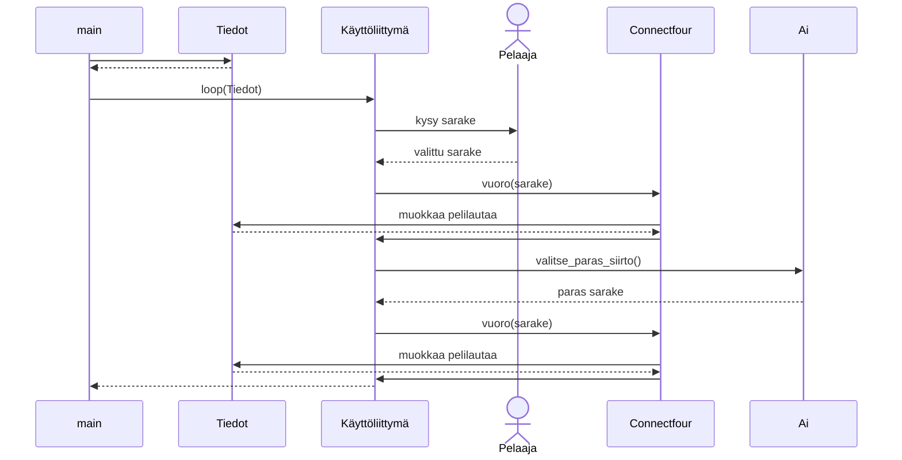

# Toteutusdokumentti

Ohjelman kulku sekvenssikaaviona:

Kaaviossa mallinnettu tilanne, jossa pelaajan vuoro on ensin. 

Minimaxin aikavaativuus on alfa-beta-karsinnan kanssa enintään O(b^m), missä b on mahdollisten siirtojen määrä ja m on puun suurin syvyys.
Pelissä on käytössä syvyys 6. Peli toimii jotenkin myös syvyyksillä 7-9, mutta minimax on tällöin jo aika hidas, jolloin peliä ei ole niin mielekäs pelata. Syvyydellä 10 pelaus ei enää onnistunut, koska pygame valitti ohjelman hitautta. 

**Parannusehdotukset:**

* Tekoälyn parantaminen niin että voisi pelata suuremmillakin syvyyksillä.

* Käyttöliittymän parantaminen niin, että voisi valita kumpi aloittaa. 

**Lähteet:**

https://en.wikipedia.org/wiki/Minimax 

https://www.geeksforgeeks.org/minimax-algorithm-in-game-theory-set-4-alpha-beta-pruning/ 

Ei käytetty laajoja kielimalleja.
