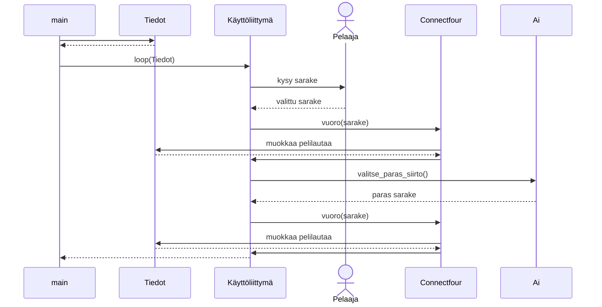

# Toteutusdokumentti

Ohjelman kulku sekvenssikaaviona:

Kaaviossa mallinnettu tilanne, jossa pelaajan vuoro on ensin. 

**Lähteet:**

https://en.wikipedia.org/wiki/Minimax 

https://www.geeksforgeeks.org/minimax-algorithm-in-game-theory-set-4-alpha-beta-pruning/ 

Ei käytetty laajoja kielimalleja.
